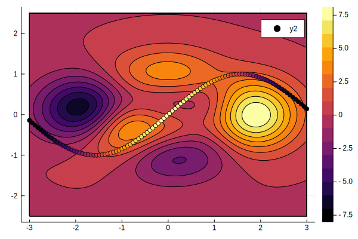

# Testing git-lfs

I produced a figure with Julia code and saved it as `test.svg` in `fig/` (which is `gitignore`d).

I set git-lfs to track svg files via

```bash
git lfs track "*.svg"
```

and also made sure I was tracking `.gitattributes` via

```
git add .gitattributes
```

and finally just added/committed the file the usual way

```
git add -f fig/test.svg
```

This figure is now available as svg through git-lfs (so not in the repo per say) and hopefully you can see it below

 

This is not very good... For comparison, here is the same figure but tracked without git-lfs:


